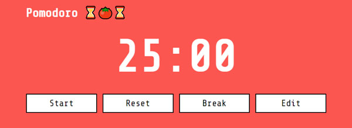
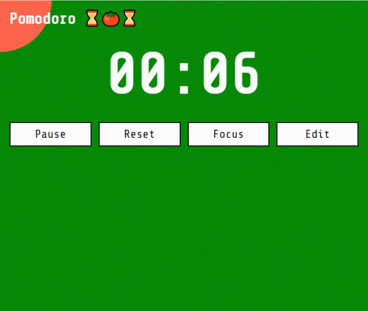

<h1 align="center">
    
</h1>

    
    

# Pomodoro React

Ссылка на проект в gh-pages: **[Pomodoro React GH pages](https://comediant24.github.io/pomodoro-react/)**

## ✍🏻 Краткое описание проекта

Для управления приложением используется свойство объекта ref `current`, которое принимает null при паузе и значение при старте счетчика. Конфиг кнопок управления прописан в отдельном файле. Изменение переменной состояния оставшегося времени проиходит функцией `setInterval`. Для управления стилями используется `styled components 💅🏻`. Для него описан глобальный стиль. Интерфейс адаптивен до `320px`. На девайсах по окончанию счетчика происходит вибрация - для этого задействован `Navigator API`. Во время работы счетчика происходит смена цвета бекграунда - это работа `css` свойства `clip-path` значение которого привязано к переменным состояния.

## 🌿 Обновления
0.5.0 - стартовая версия

0.6.0 - добавлен свервис воркер для pwa

## 📖 Задачи

Изучить работу `ref` не только для `input`, изуть свойство `clip-path`, узнать о `Navigator API` и его методах, познакомиться с работай `setInterval`.

## 📹 Демонстрация работы интерфейса

#

## 📹 Демонстрация работы `clip-path`

#

## 🧰 Инструменты

- HTML, CSS
- Javascript
- React, React hooks
- Navigator API

## 🆕 Будущие обновления

- [ ] Переписать код с использованием Redux ?
- [ ] Переписать код на TypeScript ?
- [ ] Хранить пользовательские настройки в localStorage

## 💻 Установка зависимостей

##### `npm install` – установить зависимости проекта

##### `npm start` – запуск devServer на http://localhost:3000/

##### `npm build` – production сборка проекта
